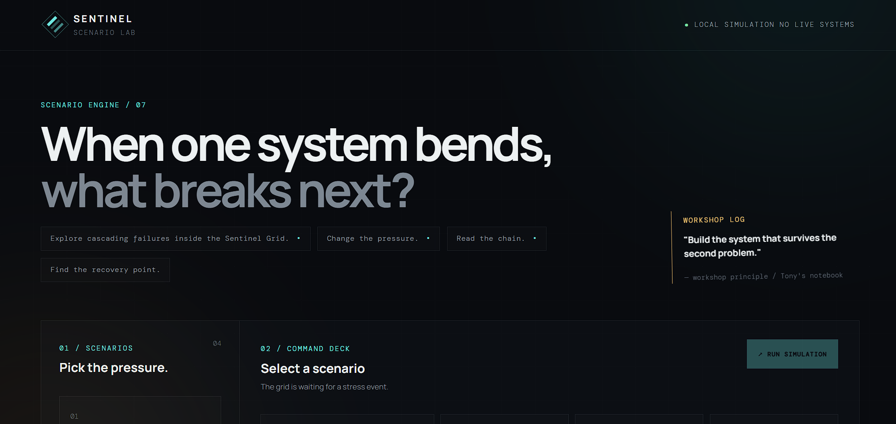

# SENTINEL — Scenario Lab

A local-only systems resilience simulator built for portfolio demonstration.

Instead of monitoring real devices or exposing a general API, SENTINEL lets a viewer explore fictional crisis scenarios and see how a complex system's resilience changes when stress is introduced.

- No cloud service
- No database
- No external API
- No live telemetry
- Works locally from static files

---

## How to Run ?

Open:

`app/index.html`

### Optional local server

```powershell
python run.py
```

Then open:
http://127.0.0.1:8080

This is a local-only demo server, not a production deployment.

### What Sentinel Demonstrates

Sentinel is a scenario-analysis laboratory, not a real monitoring or predictive system.
It uses controlled fictional scenarios to explore how failures in a complex system can propagate through dependent components, change system conditions.

## The viewer's workflow is:

Choose a fictional failure scenario → run it → observe how a local problem propagates through dependent systems → examine recovery priorities.

That is the core purpose of Sentinel.

### The Four Scenarios
 
| Scenario | What the viewer tests | What they should observe |
|---|---|---|
| **Silent Grid** | Loss of communications | Physical systems remain operational, but navigation and operations degrade |
| **Redline Cooling** | Thermal capacity loss during demand | A local cooling problem increases system-wide pressure |
| **Doomsday** | Two faults arriving before recovery | Recovery started too early creates additional system pressure |
| **Workshop Ghost** | Human decision overload | Machines remain healthy while the operator becomes the bottleneck |          

### What a Viewer Actually Does

Sentinel is designed so that someone can explore the system without needing the developer to explain every control.

1. Choose a scenario
For example:
REDLINE COOLING
A cooling loop loses capacity just as the grid enters peak demand.

The viewer then clicks: RUN SIMULATION

2. Sentinel runs the fictional experiment
The interface moves through a controlled sequence:
SIMULATION RUNNING
        ↓
System metrics change
        ↓
Node states change
        ↓
Dependency chain is replayed
        ↓
Recovery state appears

The simulation is not intended to predict what will happen in a real industrial system.
It just provides a controlled environment for examining failure propagation and recovery concepts.

3. Inspect the system state
The viewer can examine the condition of individual system nodes.

This allows the viewer to reason about relationships between components.
For example:
Why did a cooling problem affect energy and operations?

Then the answer is represented through the scenario's fictional dependency chain.

4. Follow the Cascade Trace
The trace presents the sequence of events:
00:00  Cooling capacity falls below reserve
00:25  Energy demand spikes
00:51  Operations throttles non-essential load
01:44  Thermal margin returns

This provides the story of the failure rather than showing only a final status.

5. Examine Recovery Logic

The simulation concludes with recovery priorities such as:
Throttle non-critical loads
Protect thermal reserve
Avoid recovery oscillation

Sentinel therefore does not simply answer:
"Something failed."

It encourages the viewer to examine:
"What happens next, which dependencies are affected, and what should the system prioritize during recovery?"

### Portfolio Talking Points

1. Designed a scenario engine for exploring cascading-system reasoning.
2. Built a non-conventional command-center interface without a UI framework.
3. Created reproducible fictional scenarios for demonstrating system behavior.
4. Visualized resilience, pressure, dependencies, failure propagation, and
   recovery paths.
5. Deliberately kept the project local-only to avoid unnecessary deployment
   complexity.

### Scope and Limitation

1. Sentinel is a fictional simulation and visualization project.
2. The scenarios, system states, dependency relationships, metrics, and recovery recommendations are fictional.
3. They are not derived from live industrial telemetry and should not be interpreted as real-world safety, emergency, industrial, medical, security.

### Sentinel demonstrates systems-thinking concepts such as:

- Dependency
- Cascading failure
- System pressure
- Recovery timing
- Resilience
- Human factors
- Recovery prioritization

### It is an educational and portfolio project, not an operational decision system.


---

## Interface Preview

### Dashboard



### Vital System Cards


### Cascade Trace

